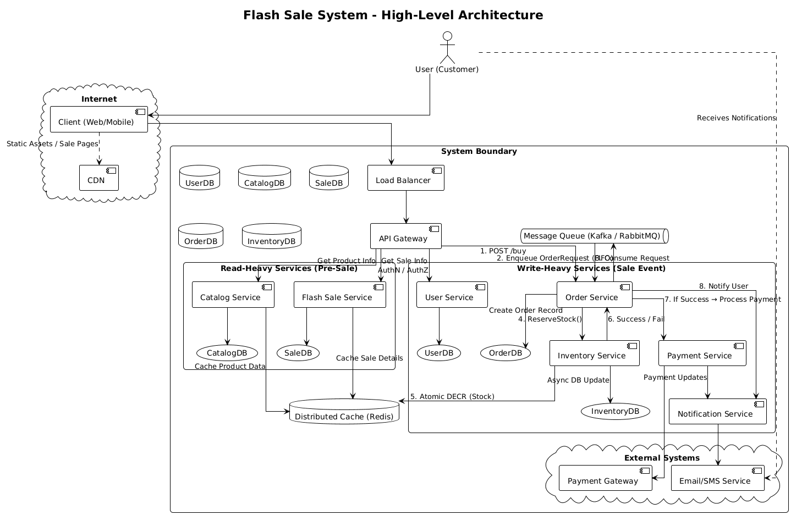

# Flash Sale System Design Workshop -  Worksheet that team has to fill or they can make they own format as well


## Overview
Design a high-traffic flash sale system for an e-commerce platform based on the .NET eShop reference architecture. This workshop will test your understanding of scalability, consistency, performance, and system design principles.

### Team Formation Instructions
**Team Requirements:**
- **Team Size:** Minimum 3 members, Maximum 4 members
- **Self-Organization:** Form your own teams based on complementary skills
- **Recommended Team Composition:**
  - 1 System Architect (overall design and integration)
  - 1 Backend Developer (microservices and data design)
  - 1 DevOps/Infrastructure Specialist (deployment and monitoring)
  - 1 Performance/Security Engineer (optional 4th member)

**Team Registration:**
- Choose a team name
- Assign roles and responsibilities
- Designate one team lead for submission coordination

**Scenario:** Your e-commerce platform wants to launch flash sales where limited quantities of products are sold at discounted prices for a short duration (e.g., 1000 units of iPhone at 50% off for 2 hours). The system must handle:
- 100,000+ concurrent users
- High read traffic during sale announcements
- Burst write traffic when sale starts
- Inventory consistency (no overselling)
- Fair ordering (first-come, first-served)

## Reference Architecture
Study the [.NET eShop](https://github.com/dotnet/eShop) microservices architecture and adapt it for flash sale requirements.

---

## Exercise 1: System Architecture Design

### Task 1.1: High-Level Architecture Diagram
**Deliverable:** Create a system architecture diagram showing all components needed for flash sales.

**Requirements to Address:**
- Microservices involved (Catalog, Inventory, Ordering, Payment, etc.)
- External systems (CDN, Load Balancers, Caching layers)
- Data storage solutions
- Message queues/Event buses
- API Gateway configuration

**Your Architecture Diagram:**
<!-- ```
[Draw/Paste your architecture diagram here]


``` -->

### Task 1.2: Service Breakdown
**Deliverable:** List and describe each microservice with its responsibilities.

| Service Name | Primary Responsibility | Key APIs | Data Store |
|--------------|----------------------|----------|------------|
| Flash Sale Service | Manage flash sale lifecycle, timing, and coordination| /flash-sales/active, /flash-sales/purchase| Redis + SQL|
| Inventory Service |Track and reserve inventory, prevent overselling | /inventory/reserve, /inventory/status| Redis + SQL|
| Order Service | Create and manage orders| /orders, /orders/{id}/status| SQL Server|
| Catalog Service | Serve product details and pricing| /products, /products/{id}| SQL Server|
| Notification Service | Send sale alerts and confirmations| /notify/email, /notify/sms| NoSQL / Queue|
| User Service |Manage user accounts and sessions | /users/login, /users/profile|SQL Server |
| Payment Service | Process payments and confirm transactions| /payments, /payments/{id}/status|External Gateway |

**Additional Services (if any):**
```
Service: Analytics Service
Purpose: Track sale performance, user behavior
Dependencies: Event Bus, Order Service
```
```
Service: Rate Limiter Service
Purpose: Prevent abuse and ensure fair access
Dependencies: API Gateway, Redis
```
```
Service: Admin Dashboard
Purpose: Manage flash sales, inventory, and reports
Dependencies: Flash Sale Svc, Inventory Svc, Notification Svc
```
---

## Exercise 2: Data Design

### Task 2.1: Database Schema Design
**Deliverable:** Design database schemas for flash sale entities.

**Flash Sale Service Schema:**
```sql
-- Design your flash sale tables here
-- Consider: flash_sales, flash_sale_items, flash_sale_participants, etc.
CREATE TABLE flash_sales (
  sale_id UUID PRIMARY KEY,
  product_id UUID NOT NULL,
  start_time TIMESTAMP NOT NULL,
  end_time TIMESTAMP NOT NULL,
  discount DECIMAL(5,2),
  total_quantity INT,
  status VARCHAR(20)
);

CREATE TABLE flash_sale_inventory (
  sale_id UUID,
  product_id UUID,
  remaining_quantity INT,
  PRIMARY KEY (sale_id, product_id)
);

CREATE TABLE flash_sale_participants (
  sale_id UUID,
  user_id UUID,
  purchase_time TIMESTAMP,
  quantity INT,
  PRIMARY KEY (sale_id, user_id)
);
```


**Inventory Service Schema:**
```sql

CREATE TABLE inventory (
  product_id UUID PRIMARY KEY,
  total_stock INT,
  reserved_stock INT,
  available_stock INT
);

CREATE TABLE inventory_locks (
  product_id UUID,
  user_id UUID,
  lock_time TIMESTAMP,
  expires_at TIMESTAMP,
  PRIMARY KEY (product_id, user_id)
);

```

### Task 2.2: Caching Strategy
**Deliverable:** Define your caching strategy and data structures.

**Redis Cache Design:**
```
Cache Layer 1 - Application Cache (Redis):
Key Pattern: flash_sale:{sale_id}
Value: { "sale_info": "...", "remaining_stock": "...", "status": "..." }
TTL: 120 seconds

Key Pattern: flash_sale_inventory:{sale_id}:{product_id}
Value:{ "remaining": 120 }
TTL: 60 seconds

Key Pattern: user_session:{user_id}
Value: { "session_token": "...", "expires": "..." }
TTL: 1800 seconds
```

**CDN Cache Strategy:**
```
Static Content Caching:
- Product images: Cache duration 24 hours
- Sale banners: Cache duration 1 hour
- JavaScript/CSS: Cache duration 7 days

Dynamic Content:
- Product availability: Cache duration 30 seconds
- Sale countdown: Use client-side polling or SSE/WebSocket
```

---

## Exercise 3: API Design

### Task 3.1: RESTful API Specification
**Deliverable:** Design the main APIs for flash sale operations.

**Flash Sale Management APIs:**
```
GET /api/flash-sales/active
Purpose: Fetch currently active flash sales 
Response: List of { saleId, productId, discount, endsIn } 
Caching: Redis + CDN (TTL 30s)

POST /api/flash-sales/{saleId}/purchase
Purpose: Attempt to purchase during flash sale 
Request Body: { "userId": "...", "quantity": 1 } 
Response: { "status": "success", "orderId": "..." } 
Rate Limiting: 1 request/sec per user via Redis token bucket

GET /api/flash-sales/{saleId}/status
Purpose: Get real-time sale status 
Response: { "remainingInventory": 120, "endsIn": "00:15:00" }
Real-time Updates: WebSocket or SSE
```

**Additional APIs:**
```
API: /api/orders/{userId} 
Method: GET 
Purpose: Fetch user’s flash sale orders 
Request/Response: { orders: [...] }
```

### Task 3.2: Event-Driven Architecture
**Deliverable:** Define events and event handlers for flash sale operations.

**Domain Events:**
```
Event: FlashSaleStarted 
Payload: { "saleId": "...", "productId": "...", "startTime": "...", "duration": "..." } 
Publishers: FlashSaleService 
Subscribers: InventoryService, NotificationService

Event: InventoryReserved 
Payload: { "saleId": "...", "userId": "...", "quantity": 1 } 
Publishers: OrderService 
Subscribers: InventoryService, PaymentService

Event: PurchaseCompleted 
Payload: { "orderId": "...", "userId": "...", "status": "success" } 
Publishers: PaymentService 
Subscribers: OrderService, NotificationService
```

---

## Exercise 4: Scalability & Performance

### Task 4.1: Load Distribution Strategy
**Deliverable:** Design your load balancing and traffic management approach.

**Load Balancing Configuration:**
```
API Gateway (YARP) Configuration:
- Routing strategy: Path-based routing
- Load balancing algorithm: Round-robin
- Health check: Ping + latency threshold
- Circuit breaker: Open after 5 failures, reset after 30s

Database Load Distribution:
- Read replicas: Serve GET requests from replicas
- Write scaling: Use async queues (e.g., RabbitMQ)
- Sharding: By saleId or productId
```

### Task 4.2: Performance Optimization
**Deliverable:** Identify performance bottlenecks and optimization strategies.

**Bottleneck Analysis:**
| Component | Potential Bottleneck | Optimization Strategy | Expected Improvement |
|-----------|---------------------|----------------------|---------------------|
| Database Writes | High write contention| Async queue + batch inserts| 5x throughput|
| Inventory Checks | Race conditions| Redis atomic Lua scripts| Prevent overselling|
| User Authentication |Token validation latency |JWT with local verification | Reduce auth latency|
| Payment Processing |External API delays | Async confirmation + retries|Improve UX|

**Caching Optimization:**
```
Cache Hit Ratio Targets:
- Product catalog: 95%
- Flash sale status: 90%
- User sessions: 98%

Cache Warming Strategy:
Preload active sales and inventory into Redis before sale starts

Cache Invalidation Strategy:
TTL + event-driven invalidation on sale end or inventory change
```

---

## Exercise 5: Consistency & Reliability

### Task 5.1: Data Consistency Strategy
**Deliverable:** Design your approach to handle data consistency in distributed system.

**ACID vs BASE Trade-offs:**
```
Strong Consistency Requirements:
- Inventory management: Why? Prevent overselling via atomic operations
- Payment processing: Why? Ensure payment confirmation before order finalization
Eventual Consistency Acceptable:
- User notifications: Why? Can be delayed or retried
- Analytics/reporting: Why? Updated asynchronously
```

**Distributed Transaction Handling:**
```
Saga Pattern Implementation:
Step 1: Reserve Inventory
- Success: Lock inventory
- Failure/Compensation: Release lock

Step 2: Process Payment
- Success: Confirm payment
- Failure/Compensation: Cancel reservation

Step 3: Confirm Order
- Success: Mark order complete
- Failure/Compensation: Refund + notify user
```

### Task 5.2: Failure Handling
**Deliverable:** Design fault tolerance and recovery mechanisms.

**Circuit Breaker Configuration:**
```
Service: Payment Service
Failure Threshold: 5
Timeout: 30s
Fallback: Queue for retry + notify user

Service: Inventory Service
Failure Threshold: 3
Timeout: 15s
Fallback: Serve cached inventory + retry
```

**Retry Policies:**
```
Operation: Database Write
Retry Count: 3
Backoff Strategy: Exponential (100ms → 400ms → 800ms)
Circuit Breaker Integration: Pause retries if breaker is open
```

---

## Exercise 6: Security & Compliance

### Task 6.1: Security Design
**Deliverable:** Design security measures for flash sale system.

**Authentication & Authorization:**
```
User Authentication:
- Method: OAuth 2.0 with JWT
- Token expiry: 15 minutes (access), 7 days (refresh)
- Rate limiting per user: 5 requests/sec

API Security:
- Authentication scheme: Bearer token (JWT)
- Rate limiting strategy: Redis token bucket per IP/user
- DDoS protection: Cloudflare + API Gateway throttling

```

**Data Protection:**
```
PII Data Handling:
- Encryption at rest: AES-256 via database provider
- Encryption in transit: TLS 1.2+
- Data retention policy: 90 days for logs, 1 year for orders

Payment Data:
- PCI DSS compliance approach: Use third-party PCI-compliant gateway (e.g., Stripe)
- Tokenization strategy: Store only payment tokens, never raw card data

```

### Task 6.2: Fraud Prevention
**Deliverable:** Design fraud detection and prevention measures.

**Bot Detection:**
```
Detection Methods:
- Rate limiting: Redis + API Gateway
- CAPTCHA integration: Google reCAPTCHA on purchase endpoint
- Behavioral analysis: Monitor click patterns, velocity, and IP reputation

Prevention Measures:
- Account verification: Email/SMS OTP before purchase
- Purchase limits: Max 1 unit per user per sale
- Suspicious activity handling: Flag and queue for manual review

```

---

## Exercise 7: Monitoring & Observability

### Task 7.1: Metrics & Monitoring
**Deliverable:** Define key metrics and monitoring strategy.

**Business Metrics:**
| Metric | Purpose | Target Value | Alert Threshold |
|--------|---------|--------------|----------------|
| Sale conversion rate | Measure effectiveness|>10% | <5%|
| Average response time | Ensure fast user experience| <200ms	|>500ms|
| Inventory accuracy |Prevent overselling | 100%|<99% |
| Payment success rate |Track transaction reliability | >98%| <95%|

**Technical Metrics:**
```
Application Performance:
- Request latency P99: <300ms
- Throughput (RPS): 10,000+
- Error rate: <1%

Infrastructure Metrics:
- CPU utilization: <70%
- Memory usage: <75%
- Database connections: <80% of max pool

```

### Task 7.2: Logging & Tracing
**Deliverable:** Design logging and distributed tracing strategy.

**Logging Strategy:**
```
Log Levels and Content:
ERROR: Exceptions, failed transactions
WARN: Retry attempts, degraded performance
INFO: Successful operations, user actions
DEBUG: Dev-only traces, payloads

Structured Logging Format:
{
  "timestamp": "...",
  "level": "...",
  "service": "...",
  "traceId": "...",
  "userId": "...",
  "operation": "...",
  "duration": "...",
  "result": "..."
}

```

**Distributed Tracing:**
```
Trace Correlation:
- Trace ID generation: UUID per request
- Cross-service propagation: W3C Trace Context headers
- Sampling strategy: 10% for normal, 100% for errors

```

---

## Exercise 8: Deployment & DevOps

### Task 8.1: Infrastructure as Code
**Deliverable:** Design your deployment architecture.

**Container Strategy:**
```
Containerization Approach:
- Base images: Alpine + .NET SDK
- Multi-stage builds: Yes (build → runtime)
- Resource limits: CPU 500m, Memory 512MB per service

Orchestration:
- Platform choice: Kubernetes (AKS/EKS)
- Scaling strategy: HPA based on CPU/RPS
- Rolling update strategy: Canary deployments

```

**Environment Strategy:**
```
Development Environment:
- Local development setup: Docker Compose
- Database seeding: SQL scripts + mock data
- Service mocking: WireMock or custom stubs

Production Environment:
- Auto-scaling triggers: CPU >70%, RPS > threshold
- Resource allocation: Based on load estimation
- Backup strategy: Daily snapshots + offsite storage

```

### Task 8.2: CI/CD Pipeline
**Deliverable:** Design continuous integration and deployment pipeline.

**Pipeline Stages:**
```
1. Code Commit
   - Trigger: Git push to main/dev
   - Actions: Lint, static analysis

2. Build & Test
   - Unit tests: xUnit/NUnit with 90% coverage
   - Integration tests: Docker-based service tests
   - Performance tests: k6 or JMeter

3. Staging Deployment
   - Validation steps: API smoke tests
   - Smoke tests: Health check + basic flows

4. Production Deployment
   - Deployment strategy: Blue/Green
   - Rollback plan: Previous container version
   - Health checks: Liveness/readiness probes

```

---

## Exercise 9: Capacity Planning

### Task 9.1: Load Estimation
**Deliverable:** Calculate system capacity requirements.

**Traffic Estimation:**
```
Peak Load Calculations:
- Expected concurrent users: 100,000
- Requests per second: 20,000
- DB transactions/sec: 5,000
- Cache operations/sec: 15,000

Growth Planning:
- 6-month projection: 2x traffic
- 1-year projection: 5x traffic
- Scaling triggers: CPU >70%, queue depth > threshold

```

**Resource Requirements:**
| Component | CPU | Memory | Storage | Network |
|-----------|-----|--------|---------|---------|
| API Gateway | 2 vCPU|2 GB | 10 GB|1 Gbps |
| Flash Sale Service |4 vCPU |4 GB |20 GB |2 Gbps |
| Inventory Service |4 vCPU |4 GB |20 GB |2 Gbps |
| Database | 8 vCPU| 16 GB|100 GB |2 Gbps |
| Cache (Redis) | 2 vCPU|2 GB |5 GB |1 Gbps |

### Task 9.2: Cost Optimization
**Deliverable:** Analyze cost implications and optimization strategies.

**Cost Analysis:**
```
Infrastructure Costs:
- Compute resources: $2,000/month
- Storage costs: $300/month
- Network costs: $500/month
- Third-party services: $400/month

Cost Optimization Strategies:
- Reserved instances: 30% savings on compute
- Auto-scaling policies: Scale down during off-peak
- Resource right-sizing: Monitor usage and adjust limits

```

---

## Exercise 10: Testing Strategy

### Task 10.1: Test Plan Design
**Deliverable:** Create comprehensive testing strategy.

**Testing Pyramid:**
```
Unit Tests:
- Coverage target: 90%
- Test categories: Business logic, validation
- Mock strategies: Moq, Fake services

Integration Tests:
- Service-to-service: REST + gRPC calls
- DB integration: Testcontainers or in-memory DB
- External API integration: Mocked gateways

End-to-End Tests:
- Critical user journeys: Login → Purchase → Confirmation
- Cross-browser testing: Chrome, Firefox, Safari
- Mobile responsiveness: Responsive layout tests

```

### Task 10.2: Performance Testing
**Deliverable:** Design load and stress testing approach.

**Load Testing Scenarios:**
```
Scenario 1: Normal Flash Sale Load
- Virtual users: 10,000
- Ramp-up time: 5 mins
- Test duration: 30 mins
- Success criteria: <1% error rate, <300ms latency

Scenario 2: Peak Load (Sale Start)
- Virtual users: 100,000
- Ramp-up time: 2 mins
- Test duration: 15 mins
- Success criteria: No crashes, <500ms latency

Scenario 3: Stress Testing
- Load increase strategy: 10k users every minute
- Breaking point identification: Monitor error spike
- Recovery testing: Restart services, validate recovery

```

---

## Submission Guidelines

### Required Deliverables:

1. **Architecture Document** (Exercises 1-2)
   - High-level architecture diagram
   - Service specifications
   - Database design
   - Caching strategy

2. **API Specification** (Exercise 3)
   - RESTful API documentation
   - Event schema definitions
   - Integration patterns

3. **Technical Design** (Exercises 4-6)
   - Scalability solutions
   - Consistency guarantees
   - Security measures
   - Performance optimizations

4. **Operations Plan** (Exercises 7-8)
   - Monitoring strategy
   - Deployment architecture
   - CI/CD pipeline design

5. **Capacity & Testing Plan** (Exercises 9-10)
   - Resource requirements
   - Cost analysis
   - Testing strategy

### Evaluation Criteria:


- **Completeness** (25%): All sections addressed with thoughtful responses
- **Technical Accuracy** (25%): Solutions demonstrate understanding of distributed systems
- **Scalability** (20%): Design handles specified load requirements
- **Trade-off Analysis** (15%): Clear reasoning for design decisions
- **Real-world Applicability** (15%): Practical solutions that can be implemented

Will not publish result but I will declare which team is winner

### Submission Format:
- Complete this worksheet with your responses
- Include any additional diagrams or code snippets
- Provide references to eShop architecture components where applicable
- Submit as a markdown file with embedded diagrams

---

**Estimated Time:** 8-12 hours
**Difficulty:** Advanced
**Prerequisites:** Understanding of microservices, docker container, distributed systems, and .NET ecosystem

Good luck

- By Divyang Panchasara